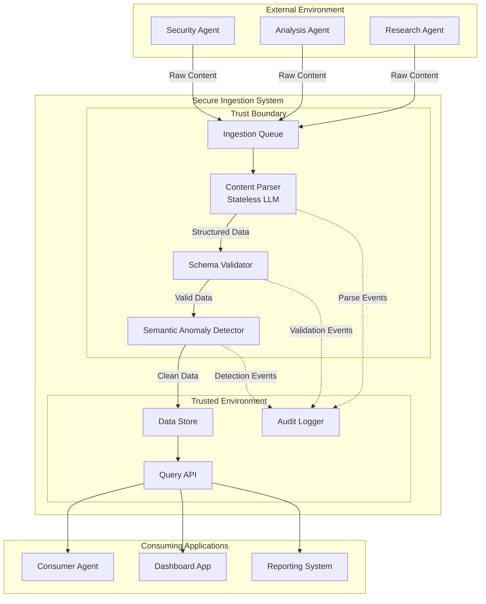
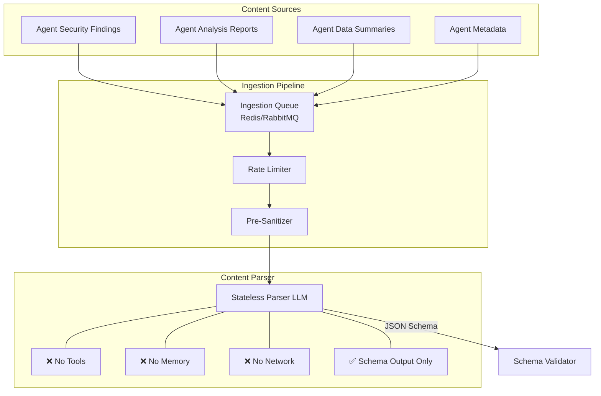
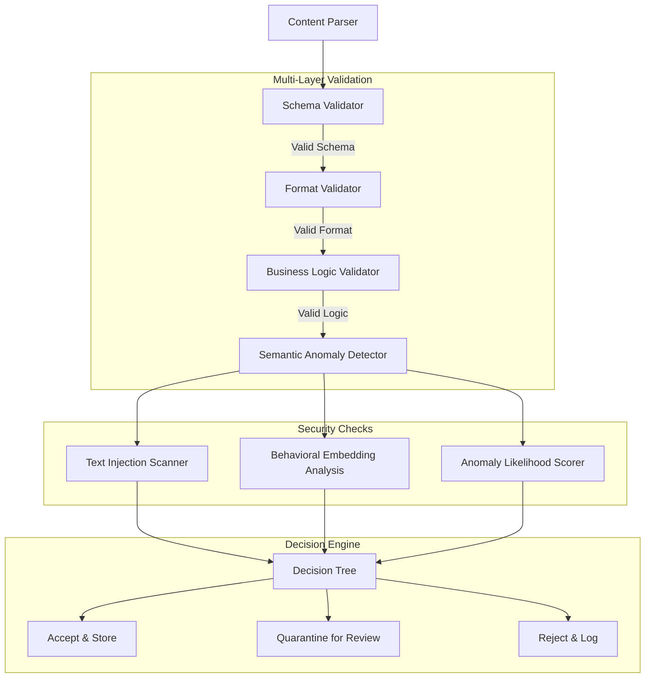
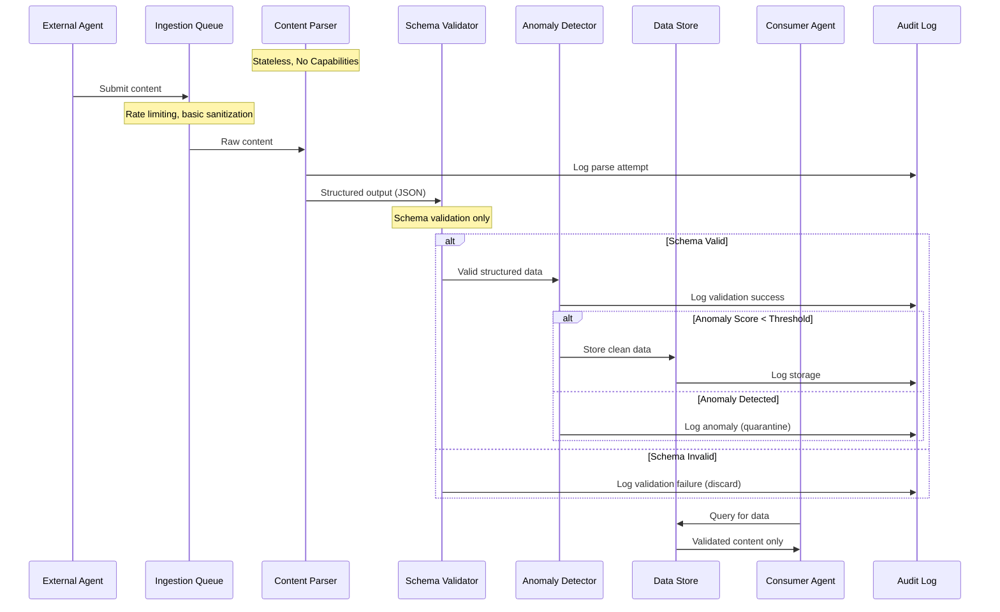
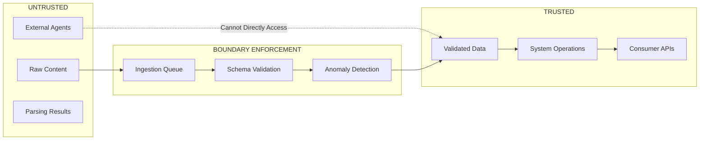
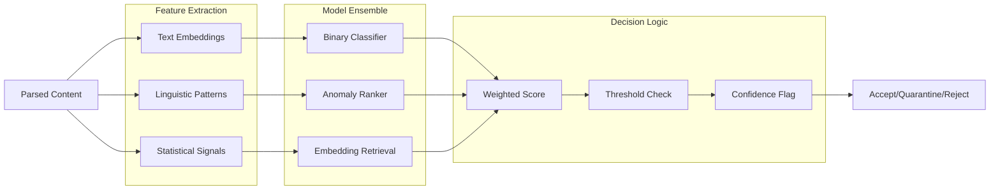
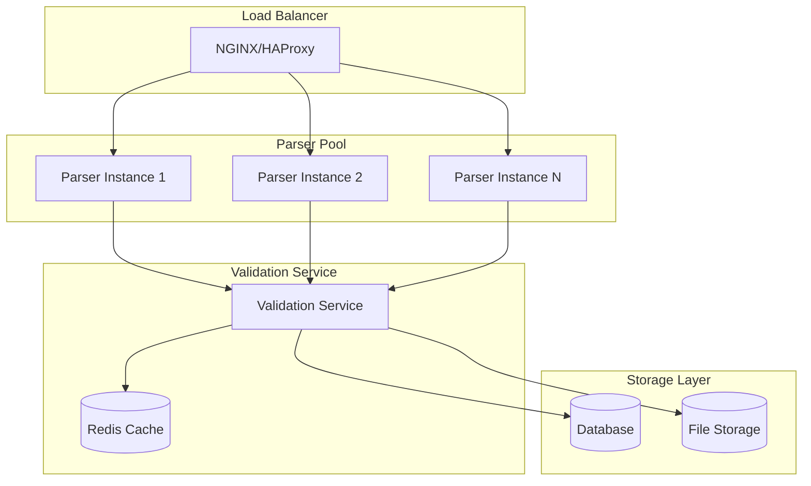
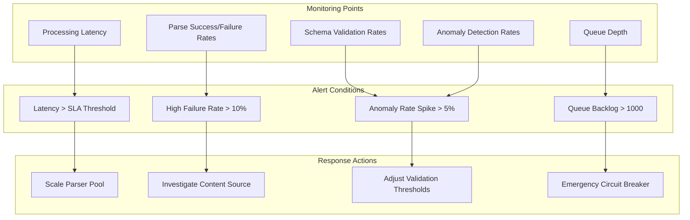

# System Architecture: Secure Agent Content Ingestion

## Overview

The Secure Agent Content Ingestion System implements a **layered defense architecture** that enables safe consumption of content from other agents without risk of prompt injection. The system follows the principle of **architectural constraints over prompt constraints**, making attacks structurally impossible rather than just detectable.

### Architectural Foundation & Attribution

This architecture synthesizes and implements security patterns established by leading AI security researchers:

- **Design patterns** from Beurer-Kellner et al. (arxiv:2506.08837), particularly the Dual LLM and Action-Selector patterns
- **Control flow integrity** principles from DeepMind's CaMeL framework (Debenedetti et al.)
- **OS-level security controls** from NVIDIA AI Red Team sandboxing guidance
- **Layered defense strategies** from Lakera's indirect prompt injection research

Our contribution is applying these proven principles to the specialized domain of agent-to-agent content ingestion.

## Core Architecture Principles

1. **Trust Boundary Enforcement**: Clear separation between trusted system operations and untrusted content processing
2. **Capability Isolation**: Parsers have no tools, memory, or network access
3. **Schema-First Validation**: All content must conform to predefined schemas or be discarded
4. **Semantic Anomaly Detection**: ML-based detection of injection-like patterns
5. **Layered Defense**: Multiple independent security mechanisms

## System Overview



## Detailed Component Architecture

### 1. Content Ingestion Layer



### 2. Validation and Security Layer



### 3. Data Flow Security



## Trust Boundary Analysis

### Critical Trust Boundaries



### Security Guarantees at Each Boundary

1. **Ingestion Boundary**
   - Rate limiting prevents DoS
   - Basic sanitization removes obvious attacks
   - Queueing provides isolation and auditing

2. **Parser Boundary**
   - Stateless LLM cannot be compromised persistently
   - No tool access prevents action execution
   - Schema enforcement limits output format

3. **Validation Boundary**
   - Strict schema compliance required
   - Semantic analysis detects injection patterns
   - Multi-layer validation catches edge cases

4. **Storage Boundary**
   - Only validated content enters trusted storage
   - Audit trail for all decisions
   - Access controls on stored data

## Component Specifications

### Stateless Content Parser

**Design Principles:**

- **No Persistent State**: Each parse operation is completely isolated
- **No Capabilities**: Cannot call tools, access network, or store data
- **Schema-Constrained Output**: Can only produce predefined JSON structures
- **Sandboxed Execution**: Runs in isolated compute environment

**Implementation Requirements:**

```yaml
parser:
  model: "fast-parsing-model"  # Optimized for structured output
  max_tokens: 2048
  temperature: 0.1            # Deterministic parsing
  capabilities: []            # No tools whatsoever
  memory: false              # Stateless operation
  network_access: false     # No external connections
  output_schema: "strict"    # Must conform to predefined schemas
```

### Schema Validator

**Supported Schemas:**

- Security findings (CVE, CVSS, recommendations)
- Analysis reports (structured insights, confidence scores)
- Data summaries (metrics, trends, key points)
- Metadata (timestamps, source attribution, versions)

**Validation Levels:**

1. **Structural**: JSON schema compliance
2. **Format**: Field format validation (dates, IDs, ranges)
3. **Business Logic**: Domain-specific rules and constraints
4. **Cross-Reference**: Consistency with existing data

### Semantic Anomaly Detector

**Detection Strategies:**

1. **Text Pattern Analysis**: Regex patterns for common injection techniques
2. **Embedding Similarity**: Compare to known injection attempts using sentence embeddings
3. **Behavioral Analysis**: Detect unusual instruction-like language in data fields
4. **Statistical Outliers**: Flag content with unusual linguistic properties

**ML Model Pipeline:**



## Performance Considerations

### Throughput Optimization

- **Parallel Processing**: Multiple parser instances for high-volume ingestion
- **Caching**: Schema validation results cached for repeated patterns  
- **Batching**: Process multiple similar content pieces together
- **Fast Models**: Optimized LLMs for parsing (vs. general reasoning)

### Latency Optimization

- **Streaming**: Process content as it arrives rather than batch processing
- **Early Rejection**: Fail fast on obvious invalid content
- **Optimistic Processing**: Begin downstream processing before full validation
- **Resource Pooling**: Pre-warmed parser instances

### Scalability Architecture



## Security Properties

### Formal Security Guarantees

1. **Isolation Guarantee**: Untrusted content cannot execute actions in the parsing environment
2. **Output Constraint**: Parser can only produce predefined structured formats
3. **State Independence**: Each parsing operation cannot influence future operations
4. **Capability Separation**: Validation logic runs separately from parsing logic

### Attack Resistance Properties

1. **Prompt Injection Immunity**: Parser has no tools to be hijacked
2. **Memory Poisoning Resistance**: Stateless operation prevents persistent compromise
3. **Exfiltration Prevention**: No network access from parsing environment
4. **Escalation Prevention**: Validated data cannot influence system operations

### Monitoring and Alerting



This architecture provides **provable security guarantees** while maintaining **production-ready performance** for safe agent-to-agent content ingestion at scale.
